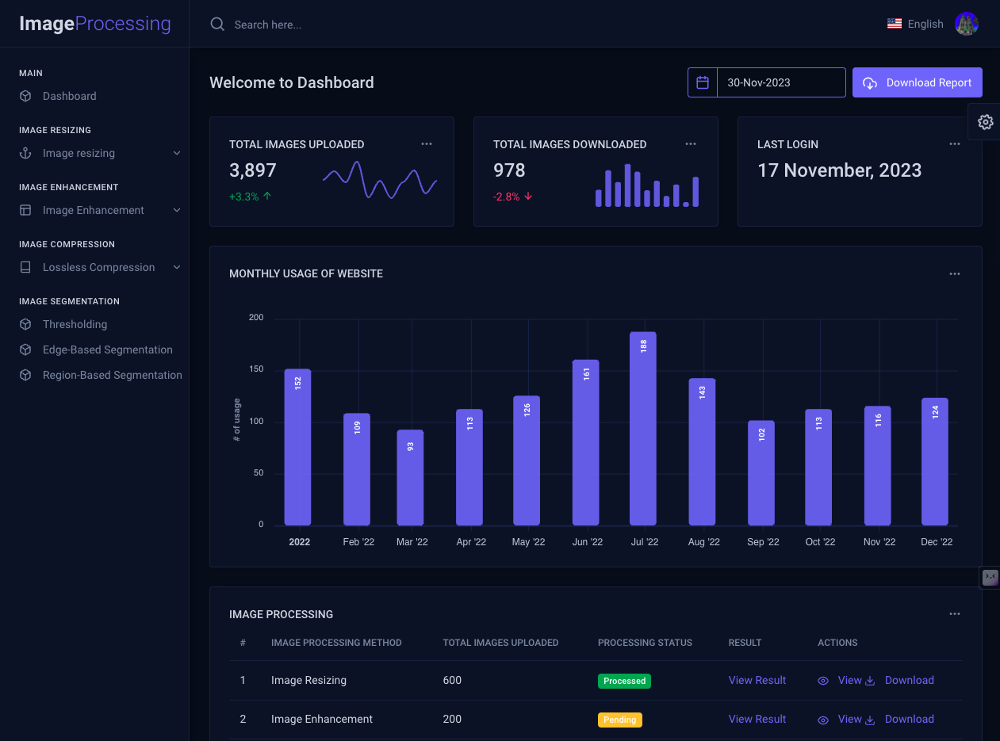
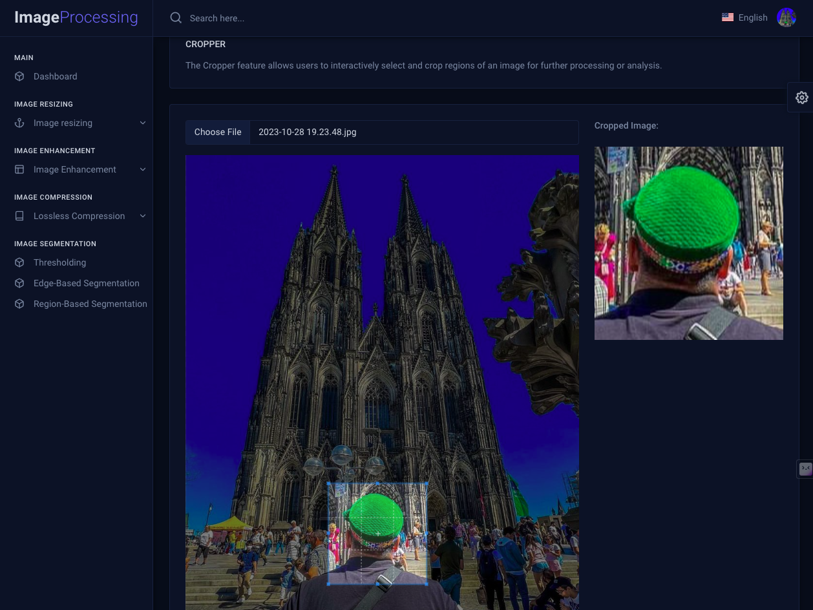
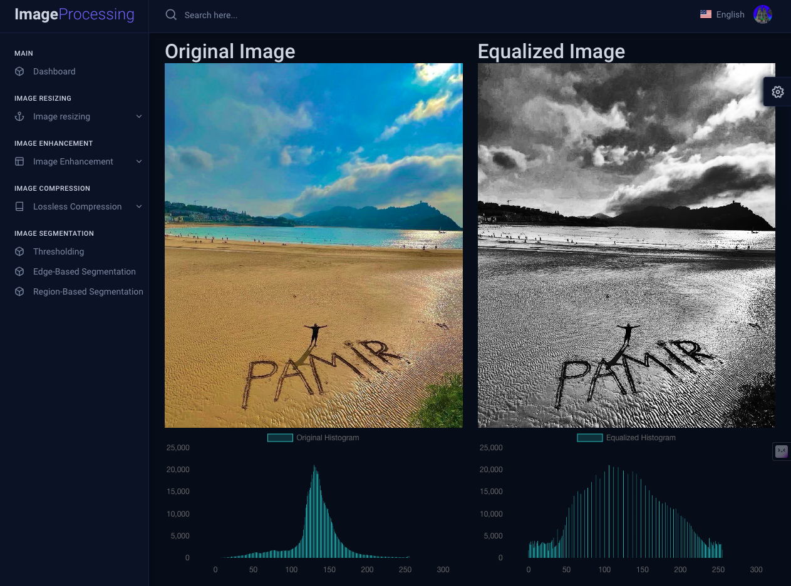
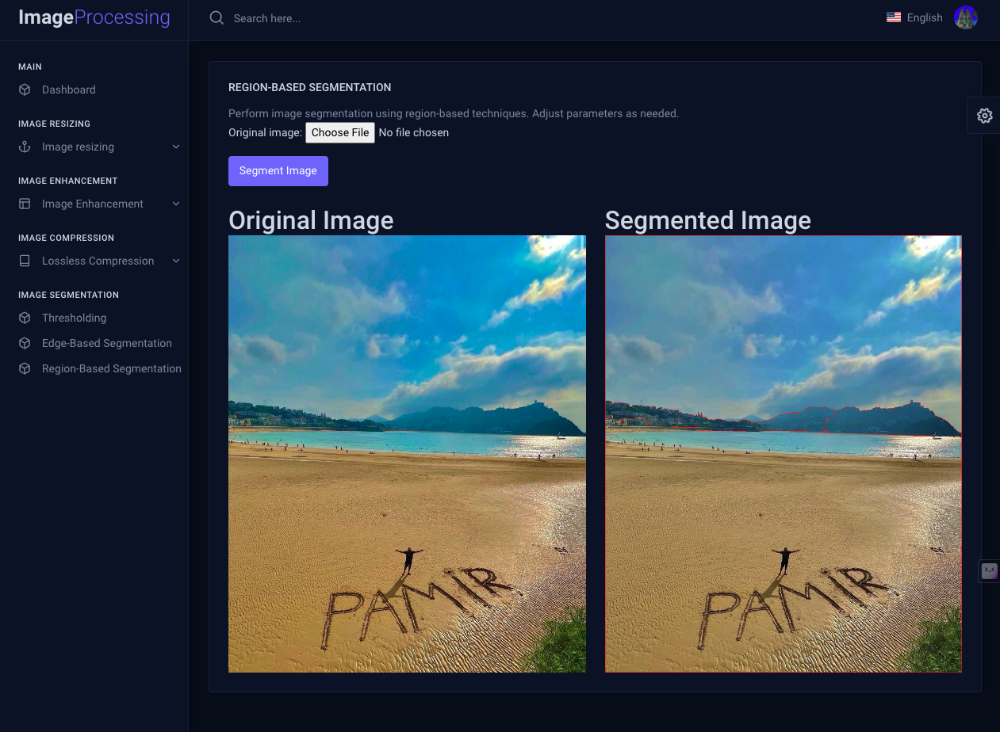

# Image Processing Project with Django

Welcome to the Image Processing Project, a Django-based web application for various image processing tasks. This project provides functionalities for image resizing, enhancement, lossless compression, and image segmentation.

## Algorithms Implemented

### Image Resizing

#### Bilinear Interpolation
Bilinear interpolation is used for resizing images by calculating the color values of pixels based on the weighted average of their neighboring pixels.

#### Nearest-Neighbor Interpolation
Nearest-neighbor interpolation is a simple resizing algorithm that selects the value of the nearest pixel for the new image.

### Image Enhancement

#### Image Negatives
The image negatives algorithm inverts the colors of the image, creating a photographic negative effect.

#### Contrast Stretching
Contrast stretching expands the range of color values in an image, enhancing the overall contrast.

#### Histogram Equalization
Histogram equalization is a technique to adjust the exposure of an image by redistributing the intensity levels.

### Lossless Compression

#### Huffman Coding
Huffman coding is applied to achieve lossless compression of images, optimizing the storage space required.

### Image Segmentation

#### Thresholding
Thresholding separates an image into regions based on a specified threshold value, classifying pixels as foreground or background.

#### Edge-Based Segmentation
Edge-based segmentation identifies boundaries and edges within an image to define regions.

#### Region-Based Segmentation
Region-based segmentation groups pixels into regions with similar properties, creating distinct segments in the image.

## Screenshots

## Getting Started

1. Clone the repository: `git clone https://github.com/your-username/image-processing-django.git`
2. Install dependencies: `pip install -r requirements.txt`
3. Run the Django development server: `python manage.py runserver`
4. Visit [http://localhost:8000](http://localhost:8000) in your browser.

## Contributing

Feel free to contribute to the project by opening issues or submitting pull requests. Follow the [contribution guidelines](CONTRIBUTING.md) for more details.

## License

This project is licensed under the [MIT License](LICENSE).
